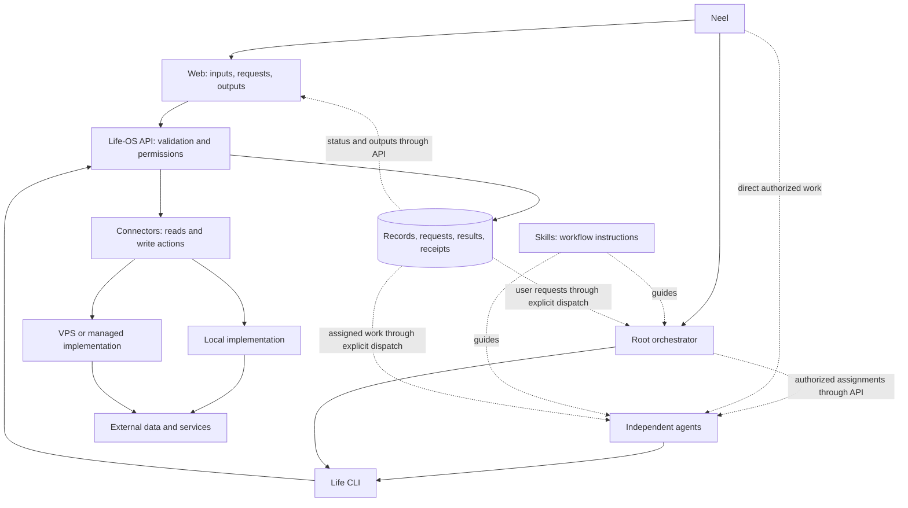

# Life-OS architecture

Codified September 26, 2026. These are the agreed architectural boundaries for one developer and one owner. They guide future implementation; they do not authorize deployment, provider consent, credential migration, or every feature described here. Current implementation scope remains in [AGENTS.md](../AGENTS.md).

Design status: in review, revised after [adversarial review](SECURITY-REVIEW.md) and Neel's subsequent scope decisions. The [human and agent authentication contract](AUTHENTICATION.md) specifies enrollment, verification, permissions, credential lifecycle, and acceptance criteria. Hosting/secret-store binding and request/scheduled dispatch remain open. Strong runtime isolation is deferred; it is not an initial release gate.

## Core model

Life-OS has an AI agent execution layer and a user-facing web layer, backed by one shared API and permissioned connectors.

- **A root orchestrator coordinates multiple independent agents.** Each agent acts through skills and the CLI with its own identity and permissions. The root plans and delegates; independent agents execute authorized work and publish results. Codex is the current execution environment.
- **The web accepts user inputs and presents user-requested outputs.** It collects requests and decisions, shows progress and results, and supports direct user interactions such as the existing task and calendar forms.
- **Connectors expose data and write actions with credentials and permissions.** Their contract does not depend on whether execution is local, on a VPS, or in a managed service.
- **The API enforces the rules.** Clients and skills do not hold provider credentials or bypass validation, authorization, and domain behavior.

The deployment target is an always-on private application accessible from Neel's devices. A trusted managed service may hold credentials. Minimize code and services that one developer must maintain.

Confirmed first-version choices: the root has full application-data visibility through its own configurable read policy; independent agents keep separate permissions and may act on schedules/triggers Neel configures. Retain the existing Codex runtime and enforce permissions in the Life-OS API. Shared files, tools, and conversations are not strongly isolated initially. Later, root visibility can narrow and isolated runtimes can strengthen the boundary. Full root visibility does not grant credential access, permission administration, unrestricted writes, or self-approval. See [confirmed initial scope](AUTHENTICATION.md#confirmed-initial-scope).

The request/result path is a target contract, not a claim that web-to-agent dispatch already exists. No replacement agent runtime, in-app chat, or continuously running AI process is required by this design.

## Responsibilities

| Component | Owns |
|---|---|
| Root orchestrator | Request interpretation, planning, permitted assignment of work, progress tracking, synthesis of authorized results |
| Independent agent | Its own skills, credential, capability limits, evidence gathering, execution, and result publication; can receive direct authorized work |
| Skill | Workflow instructions, CLI usage, evidence requirements, and when user decisions are needed |
| CLI | Structured commands and machine-readable responses over HTTP; the agent's Life-OS execution surface |
| Web | User inputs, requests, decisions, direct forms, execution status, and requested outputs |
| API / Tools | Authentication, permission enforcement, validation, domain rules, persistence, idempotency, receipts |
| Connector | Declared reads/actions, provider mapping, connection lifecycle, and required permissions |
| Execution adapter | Invocation of a connector locally or through an authenticated remote service |
| Credential custodian | Protected storage and lifecycle of the credentials assigned to it |

Keep the existing `apps/web` React/Vite app, Node/Hono API, `Tools`, PostgreSQL, and HTTP CLI. The web continues through its server-side same-origin bridge. Straightforward user edits can call existing API operations directly; they do not require an agent or a browser shell.

The orchestrator is a coordinating agent with an explicit initial grant to read all application/connector data and results. It remains separate from the owner: the API cannot let it mint credentials, retrieve secrets, expand permissions, or approve its own actions. Write and dispatch permissions remain distinct from visibility. Each independent agent has a stable identity; each runtime installation receives a separate credential bound to that identity and environment. A run is an assignment to an identity, not a new agent account.

The API records and checks assignments against owner-authorized workflow limits. Independent agents authenticate directly; they do not borrow the root's key or require it to proxy operations. The root's initial policy allows all results and underlying data, and remains configurable for later restriction. Independent work can come from direct requests, root assignments, or owner-configured schedules/triggers; it does not depend on the root remaining online. See [agent coordination and identity](AUTHENTICATION.md#root-orchestrator-and-independent-agents).

## An agent-driven request

1. The user supplies inputs and a request through the web or directly to the agent.
2. For web requests, the API records the request ID, inputs, and authorized scope. An explicit dispatch mechanism makes it available to the agent. Saving a row does not automatically invoke Codex.
3. The root assigns allowed work to enrolled agents, an agent receives direct owner-authorized work, or an owner-configured schedule/trigger creates a run within standing permissions. Each follows its own skill and calls the CLI under its own credential. The root can execute operations explicitly granted to its identity.
4. The API authorizes each operation and invokes the connector. Provider content is evidence, not authority to change permissions or instructions.
5. Agents publish outputs through the CLI/API against their assigned run IDs, with relevant source links, freshness, and action receipts. The root may synthesize permitted outputs into the user-facing result against the parent request ID.
6. The web displays the result or an honest pending, needs-input, failed, or completed state.

For example, an inbox-summary request permits the agent to read allowed messages and publish a summary. Sending a reply is a separate write operation governed by provider access, Life-OS permissions, and the user's authorization. A workflow can pause for a decision without claiming completion.

Prove explicit invocation and result publication first. Introduce unattended dispatch only when a specific workflow needs it. Existing vault workflows remain governed by the vault's own instructions; this architecture does not migrate or replace them.

## Connector contract

A connector definition declares a provider, authentication methods, typed read operations, typed write actions, and the permissions required by each operation. A connection is one configured instance: a particular external account or an application-level catalog configuration.

| Connection field | Meaning |
|---|---|
| ID and owner | Stable Life-OS reference and who may use it |
| Connector / external account | Which implementation and account it represents |
| Credential reference | Reference to protected credentials, never a secret returned to clients |
| Provider grants | Actual external permissions; cached metadata does not override provider rejection |
| Enabled Life-OS permissions | The subset of operations allowed for this connection |
| Identity generation and local disablement | Version of the verified account binding; local disablement cannot be cleared by a provider callback |
| Execution target and environment | Local, remote, or managed implementation; separate development/production configuration |
| Status | Configured/connected, unavailable, disconnected, or requiring authorization |

An example Gmail connection may allow reading and searching messages while denying sending and deletion. Catalog connectors fit the same model: IGDB and TMDB use application credentials; the current Open Library implementation requires none. Public access does not bypass Life-OS's operation policy.

Share connection and permission handling while preserving domain-specific operations and results. Calendar events, messages, tasks, and catalog titles do not need one universal data schema. Extend the existing [calendar adapter](../packages/tools/src/calendar/adapter.ts) and [catalog adapter](../packages/tools/src/media/catalog/adapter.ts) patterns.

For one developer, this is a small typed contract, explicit operation registration, connection metadata, and shared checks. A plugin marketplace, dynamic code loader, general policy language, or deployment framework is not required.

## Connecting and reconnecting accounts

Google login and Google data access are separate flows. Login requests only identity scopes; Calendar/Gmail consent requests the minimum scopes for a selected connector operation. A connected account may differ from Neel's login account, but the owner must explicitly confirm its verified provider identity. Account labels or email text from the browser are not identity proof.

Only an authenticated, recently verified owner can start a connection attempt. The backend records a short-lived pending attempt bound to owner, deployment, provider/integration, requested scopes, and a new connection or specific reconnect target. Use the selected provider library/broker's authorization-code flow with state, exact registered callbacks, PKCE where supported, and issuer/nonce checks where applicable. Validate return locations against application routes. The browser receives only the scoped, short-lived connect-session capability needed for consent, never a Nango administration key or provider token.

Treat the browser's success event as a hint. The backend must verify completion with the broker/provider and match it to the pending attempt, expected integration/environment, and stable external account ID. Make finalization single-use and require the owner's active session to confirm the identified account before enabling Life-OS access. Expired, unmatched, or duplicate completions cannot create grants. Backend-controlled correlation metadata cannot be overridden by client tags. Do not auto-enable syncs/actions merely because the broker created a connection; managed execution must wait for the approved Life-OS binding and policy.

Reconnect preserves a Life-OS connection only for the same verified provider account and environment. A different account creates a new disabled connection with no inherited agent grants. Increment the connection generation on reconnection/rebinding, invalidate pending approvals and dispatch claims from the old generation, and recheck effective scopes. Broader provider consent never broadens Life-OS policy. Local disablement survives provider recovery, reconnect notifications, and late webhooks until the owner explicitly enables it.

If callbacks/webhooks are enabled, authenticate their exact payload with the broker's current signing mechanism, enforce body limits, and validate the mapped environment/integration/connection. For Nango use its HMAC verification with the environment's webhook signing key, not a legacy signature or an API key assumed to be the same secret. Handle duplicate/reordered events idempotently; a signature alone does not prove freshness. Verify current broker state before changing connection health, and never let webhook payloads authorize work, replace identities, or clear local disablement. Unknown event types are ignored. Start with on-demand status checks if webhooks are unnecessary.

These are required integration behaviors, not claims that Nango or the current calendar OAuth code already enforces Life-OS policy. References: [OAuth security requirements](https://www.rfc-editor.org/rfc/rfc9700.html), [Nango connect sessions](https://nango.dev/docs/reference/backend/http-api/connect/sessions/create), and [Nango webhook verification](https://nango.dev/docs/guides/platform/webhooks-from-nango).

## Execution location is interchangeable

Callers use the same operation name, input/output contract, and permission model regardless of location. An execution adapter calls a local function or invokes a configured remote operation. Implement only the targets actual connectors need.

- **Local:** connector code runs in the local backend or an explicitly integrated local executor.
- **VPS:** the same implementation runs on the server, or the API calls its authenticated endpoint.
- **Managed:** the API invokes a supported hosted action or sync. Using Nango only for credentials/proxying is distinct from running connector logic in Nango.

The API authorizes before dispatch. Remote execution authenticates its caller using a purpose-specific service credential and claims the stored operation against current policy immediately before execution. That credential cannot impersonate an owner or agent, create operations, or access arbitrary connections. Preserve request identity, idempotency, errors, and uncertain-write outcomes across the boundary. Do not expose arbitrary provider URLs or code execution as connector operations. Adapter destinations are administrator-configured; validate any permitted dynamic URLs and redirects against the intended provider and reject private/loopback/metadata destinations unless an explicit local adapter is configured. Managed proxy/MCP administration credentials stay server-side and are not agent tools.

Credentials resolve at the component that uses them. Development and production have separate grants and credentials even when they share an interface. A connector needing a Mac's files or local services requires that Mac to be online and reachable through an explicitly configured authenticated channel. Location independence of the contract does not make local resources universally reachable.

## Permissions and identity

The concrete [authentication design](AUTHENTICATION.md) uses Google/Clerk sessions for Neel and separately registered, scoped, expiring delegated API keys for the root and each independent agent runtime. The human CLI device-login flow is deferred; the first agent CLI uses its installed delegated key. Owner administration remains in the web.

Login establishes identity. A connector grant enables access to an external service. User authorization defines the work requested. These are distinct.

An operation must be implemented, allowed by the provider, enabled on the connection, permitted for the authenticated caller, and within the authorized request. Reads and writes have distinct permissions. Adapters map Life-OS permissions such as `mail.read` and `mail.send` to provider requirements. Broader provider grants do not automatically enable broader Life-OS actions. Missing provider grants require authorization, not a local permission toggle.

Each agent, including the root, has its own [data-access policy](AUTHENTICATION.md#per-agent-data-access): allowed accounts/collections, record subsets, readable fields, write destinations and fields, and permitted output recipients. These rules cover API-served native records, connector data, cached copies, search, saved outputs, and API-held context/memory. The root's broad visibility is an explicit read policy, not inheritance of specialist write/admin privileges. Enforce policy in API/Tools; local files and shared runtime context remain outside this initial boundary.

Stronger protection against a compromised agent additionally needs [runtime and outbound-data restrictions](AUTHENTICATION.md#runtime-trust-and-data-leaving-the-system). An unrestricted shell, owner browser, alternate tools, or shared transcripts can bypass API policy. Neel accepts that limitation for the initial Codex setup. Keep API-level destination checks and backend secrets protected, but do not claim runtime confidentiality or system-wide prevention of data export. Isolated workflow execution is later hardening; no replacement runtime is required for the first version.

Skills guide the agent; the API and execution code enforce permissions. A caller-provided `actor` string is attribution, not identity or authority. The agent uses a restricted execution credential, not the user's unrestricted administrative browser session. Human CLI login and unattended agent credentials may have different lifetimes and grants while remaining associated with the same owner.

Where a concrete action requires approval, verify approval against that action and its parameters. Do not trust an agent-supplied approval flag. Recheck permissions when executing delayed work and record authenticated caller, request/run identity, and receipt. Do not prompt again for actions already authorized within the request.

Start with Neel as the sole enrolled owner and small typed per-agent operation/data allowlists. Multiple external accounts do not imply multiple Life-OS users. Additional users would require a separate data-isolation design. Retire the current shared owner bearer token through an explicit migration before relying on per-caller restrictions.

## Credentials and secrets

Use one consistent security policy with explicit custodians; one physical store is not required. Each credential has a purpose, environment, authorized consumer, custodian, and replacement/revocation procedure. The application keeps references and status, not exposed secret values.

| Credential | Intended custody |
|---|---|
| Database credentials, IGDB secret, TMDB token, backend service keys | Secure hosting secret facility or a selected secret manager |
| Managed connector OAuth client secrets and account tokens | The managed authorization service, when selected |
| Google login configuration | The selected identity implementation's protected configuration |
| Human CLI / agent Life-OS credentials | Appropriate device or executor secret store |

The chosen facility must provide restricted access, encryption at rest, runtime access, and workable rotation/recovery. A bare VPS `.env` file is not the secure-store design. Environment variables can deliver secrets at runtime; they need not be their permanent storage. Bootstrap access uses host identity where supported or a narrowly scoped credential provisioned securely outside the repository.

Do not return provider secrets to the browser, ordinary CLI output, agent context, logs, receipts, or exports. Separate environments and inject only the secrets each runtime needs. Do not duplicate rotating tokens across custodians. Managed credential custody means the service actually holds those credentials; a second copy elsewhere does not change that trust relationship.

Preserve existing catalog behavior while changing storage deliberately. An IGDB app token can be cached in backend memory and reacquired after restart. Open Library needs no secret. Migrate existing Google credentials only after compatibility, account-ID preservation, and recovery have been checked; new consent may be required.

## Data ownership and reliability

Life-OS owns its existing native tasks, library entries, and user-authored application data. Google Calendar and Gmail remain authoritative for their external records. Catalog providers supply source facts, distinct from personal library notes and ratings. The vault remains authoritative for its governed durable knowledge.

Todoist-connected tasks and native Life-OS tasks need explicit external-ID mapping and ownership rules before two-way writes. Displaying or importing data does not silently transfer ownership. Existing vault execution through `td` remains unchanged.

Preserve current validation, version checks, idempotency, and receipts. Add the [authorization and dispatch records](AUTHENTICATION.md#standing-permissions-and-individual-requests) needed to bind approvals and retries to an exact caller, connection generation, and payload. Existing domain receipts are not proof of exactly-once remote execution. Do not automatically retry a write whose outcome is uncertain. Connection health and data freshness are separate: a failed refresh is not an empty inbox or calendar. Signing out, disabling a connection, revoking a provider grant, and deleting synchronized data are separate actions. Disabling a connection immediately blocks new agent reads from it, including cached copies; retained data is owner-only until explicitly granted again. A transient provider outage may allow already-permitted cached reads with a visible freshness warning, but not new provider actions.

Start with on-demand refresh. When a feature needs background refresh, use a bounded scheduled command with overlap prevention and persisted sync state. Add a durable queue only when demonstrated needs justify it. Keep HTTPS, private database access, backups, restoration checks, and sanitized failure reporting as deployment basics.

## Current implementation and next slice

Already implemented: the shared API, HTTP CLI, native task/calendar/library domain code, Google Calendar and catalog adapters, and web `/todo` and `/calendar`. The current local API uses one bearer token; application secrets and some provider tokens still use environment/file storage. These are the migration baseline, not claims that the target model already exists.

Not yet implemented: the general permissioned connector model, per-caller identity, secure-store migration, web-to-agent request dispatch, and result publication flow described here.

The next architectural proof is one complete workflow using synthetic data: user request, explicitly invoked agent following a skill, permitted read through CLI/API/connector, and a published output visible in the web. Verify root visibility, specialist API denials, another caller, an expired connection, and a failed execution. Verify approval/uncertain-outcome handling before external writes. Use fake providers and disposable schemas for mutation checks. Owner-configured independent schedules/triggers are part of the intended behavior; add the first one using existing scheduling infrastructure when that workflow needs it. Strong runtime isolation, remote connector execution, broad background sync, arbitrary field selectors, and multiple simultaneous runs per runtime remain deferred.

Clerk is the baseline implementation for the specified [authentication contract](AUTHENTICATION.md), with compatibility and cost verified before provisioning. Nango for managed connector authorization and the host's secret facility remain candidates. Select those based on the working slice, compatibility, total cost, and maintenance. Do not require a stack rewrite, separate secrets service, general job system, or new AI runtime upfront.

Remaining initial choices are hosting/ingress and secure storage/recovery, identity/broker compatibility and cost, request/scheduled dispatch in the existing runtime, and the first connector's permissions and data-ownership behavior. Resolve and verify these before calling the initial design deployment-ready. Strong runtime isolation and trusted context reset belong to a later phase. Implementation, personal-account connection, and deployment remain separately scoped work.

## Related documents

- [Product vision](vision/VISION.md): purpose and longer-term experiences.
- [Human and agent authentication](AUTHENTICATION.md): concrete enrollment, verification, authorization, revocation, and recovery design.
- [Adversarial design review](SECURITY-REVIEW.md): findings, design corrections, and remaining implementation gates.
- [Current API milestone](vision/API.md) and [API contract](../packages/tools/API.md): implemented HTTP boundary.
- [Tools implementation brief](../packages/tools/README.md): current domain and provider behavior.
- [Web implementation](../apps/web/README.md) and [design system](DESIGN.md): current UI and extension rules.

Candidate connector implementation references: [Nango authorization](https://nango.dev/platform/auth) and [Nango request proxy](https://nango.dev/platform/request-proxy). Product support and plans must be verified at implementation time. Identity implementation references are in [the authentication design](AUTHENTICATION.md).
