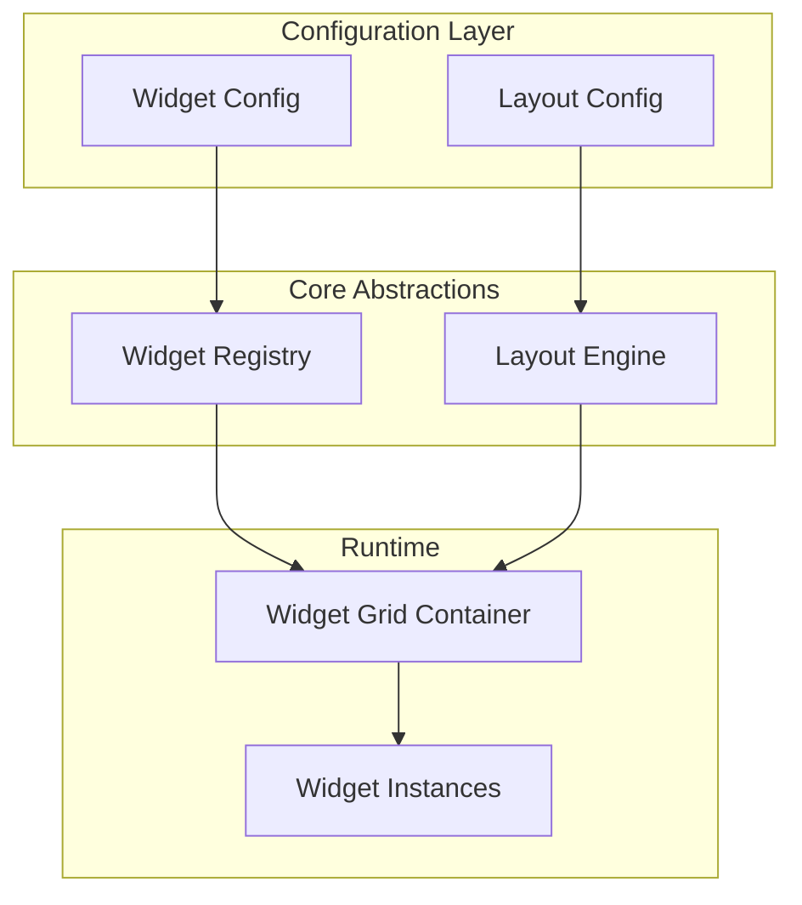

# Widget-Based Home Page System

A resizable, configurable dashboard system where widgets render data slices at runtime-computed dimensions within a responsive grid.

---

## High-Level Architecture



| Layer | Responsibility |
|-------|----------------|
| **Widget** | Self-contained view rendering a data slice. Declares size constraints. |
| **Layout Engine** | Computes pixel dimensions from logical grid units. Enforces constraints. |
| **Configuration** | Declares which widgets appear, their sizes, and placement. |
| **Registry** | Maps widget type IDs to component implementations. |

---

## Data Models & Interfaces

### Widget Definition

```typescript
// src/lib/widgets/types.ts

/** Logical grid size (columns × rows) */
interface GridSize {
  cols: number;  // e.g., 1, 2, 3
  rows: number;  // e.g., 1, 2
}

/** Pixel constraints for a widget */
interface SizeConstraints {
  minWidth: number;   // px
  minHeight: number;  // px
  maxWidth?: number;  // px, optional
  maxHeight?: number; // px, optional
}

/** Widget metadata registered in the system */
interface WidgetDefinition<TProps = unknown> {
  id: string;                          // e.g., "project-progress"
  name: string;                        // Human-readable name
  description: string;                 // For debug UI
  supportedSizes: GridSize[];          // Valid size options
  defaultSize: GridSize;               // Initial size
  constraints: SizeConstraints;        // Min/max pixel bounds
  component: React.ComponentType<WidgetProps & TProps>;
}

/** Props passed to every widget component */
interface WidgetProps {
  width: number;    // Computed pixel width
  height: number;   // Computed pixel height
  gridSize: GridSize;
}
```

### Widget Instance Configuration

```typescript
// src/lib/widgets/types.ts

/** A widget placed on a dashboard */
interface WidgetInstance {
  id: string;                // Unique instance ID
  widgetType: string;        // References WidgetDefinition.id
  size: GridSize;            // Current logical size
  position?: {               // Optional explicit grid position
    col: number;
    row: number;
  };
  props?: Record<string, unknown>;  // Widget-specific props
}

/** Dashboard layout configuration */
interface DashboardConfig {
  id: string;
  name: string;
  columns: number;           // Grid column count (responsive)
  gap: number;               // Gap between widgets (px)
  widgets: WidgetInstance[];
}
```

### Layout Grid Abstraction

```typescript
// src/lib/widgets/layout-engine.ts

interface LayoutContext {
  containerWidth: number;    // Available width (px)
  containerHeight: number;   // Available height (px)
  columns: number;           // Grid columns
  gap: number;               // Gap between cells (px)
}

interface ComputedDimensions {
  width: number;
  height: number;
  isConstrained: boolean;    // True if min/max was applied
  violation?: 'min-width' | 'min-height' | 'max-width' | 'max-height';
}
```

---

## Layout Calculation Approach

### Grid Unit → Pixel Conversion

```
cellWidth = (containerWidth - (columns - 1) * gap) / columns
cellHeight = cellWidth  // Square cells by default, or configurable ratio

widgetWidth = size.cols * cellWidth + (size.cols - 1) * gap
widgetHeight = size.rows * cellHeight + (size.rows - 1) * gap
```

### Constraint Enforcement

```typescript
function computeDimensions(
  size: GridSize,
  constraints: SizeConstraints,
  context: LayoutContext
): ComputedDimensions {
  const cellWidth = (context.containerWidth - (context.columns - 1) * context.gap) / context.columns;
  const cellHeight = cellWidth; // 1:1 aspect ratio

  let width = size.cols * cellWidth + (size.cols - 1) * context.gap;
  let height = size.rows * cellHeight + (size.rows - 1) * context.gap;

  let violation: ComputedDimensions['violation'];

  // Enforce minimums
  if (width < constraints.minWidth) {
    width = constraints.minWidth;
    violation = 'min-width';
  }
  if (height < constraints.minHeight) {
    height = constraints.minHeight;
    violation = 'min-height';
  }

  // Enforce maximums
  if (constraints.maxWidth && width > constraints.maxWidth) {
    width = constraints.maxWidth;
    violation = 'max-width';
  }
  if (constraints.maxHeight && height > constraints.maxHeight) {
    height = constraints.maxHeight;
    violation = 'max-height';
  }

  return { width, height, isConstrained: !!violation, violation };
}
```

### Resize Handling

1. **Container resize** → Recalculate all widget dimensions via `ResizeObserver`
2. **Widget overflow** → Widgets receive computed dimensions and must handle internal overflow
3. **Constraint violations** → Layout engine clamps to bounds; debug mode highlights violations

---

## File Structure

```
src/
├── lib/widgets/
│   ├── types.ts           # Core type definitions
│   ├── registry.ts        # Widget registry
│   ├── layout-engine.ts   # Dimension calculations
│   └── index.ts           # Barrel export
├── components/widgets/
│   ├── widget-wrapper.tsx         # Base wrapper with error boundary
│   ├── widget-grid.tsx            # Grid container
│   ├── project-progress-widget.tsx
│   ├── upcoming-tasks-widget.tsx
│   └── notes-widget.tsx
└── app/
    ├── debug/widgets/page.tsx     # Debug page
    └── page.tsx                   # Home page (modified)
```

---

## Debug Page Design

| Control | Purpose |
|---------|---------|
| **Widget Picker** | Dropdown to select widget type |
| **Size Grid** | Click cells to set cols × rows |
| **Container Slider** | Adjust simulated container width |
| **Mock Data Toggle** | Switch between real/mock data |
| **State Toggles** | Force loading, error, empty states |
| **Overlay Toggles** | Show constraint violations, overflow |

**Visual Indicators:**
- 🟡 Yellow border = min constraint active
- 🔴 Red border = max constraint exceeded
- 🟣 Purple overlay = content overflow detected

---

## Key Edge Cases & Tradeoffs

| Case | Handling |
|------|----------|
| **Screen too narrow** | Stack widgets to single column; allow horizontal scroll if below absolute min |
| **Conflicting constraints** | Min wins over max; log warning in dev |
| **Widget data error** | Error boundary per widget; show fallback UI |
| **Empty data** | Widget handles internally with empty state |
| **Rapid resize** | Debounce `ResizeObserver` callbacks (100ms) |
| **Many widgets** | Virtualize if >20 widgets; initial scope: no virtualization |

**Tradeoffs:**
1. **Grid-based vs Freeform** → Grid is simpler, more predictable, constraints easier to enforce
2. **Fixed vs Dynamic columns** → Responsive columns (4→2→1) based on breakpoints
3. **Server vs Client data** → Widgets fetch own data (client) for simplicity; can optimize later

---

## Implementation Phases

| Phase | Scope | Deliverables |
|-------|-------|--------------|
| **1. Widget Abstraction** | Type definitions, registry, wrapper component, 3 initial widgets | `src/lib/widgets/*`, `src/components/widgets/*` |
| **2. Layout Engine** | Dimension calculator, grid container, ResizeObserver integration | `layout-engine.ts`, `widget-grid.tsx` |
| **3. Debug Page** | Debug route, control panel, violation overlays | `/debug/widgets` |
| **4. Home Integration** | Dashboard config, wire real data, replace home page | `/page.tsx` |
